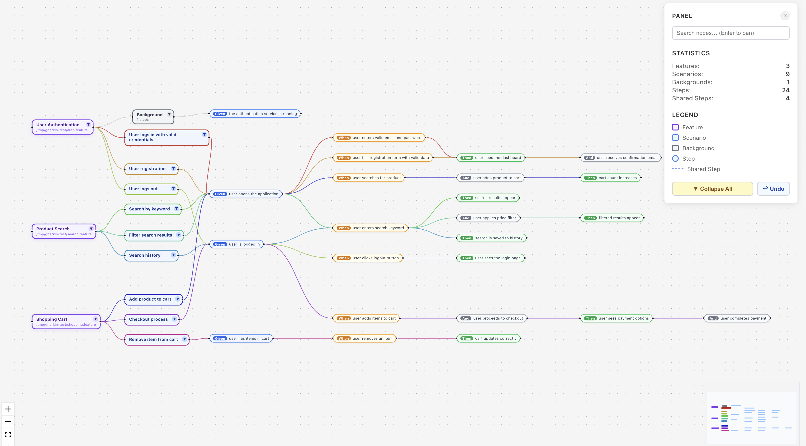
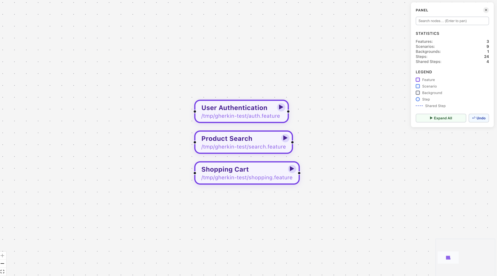
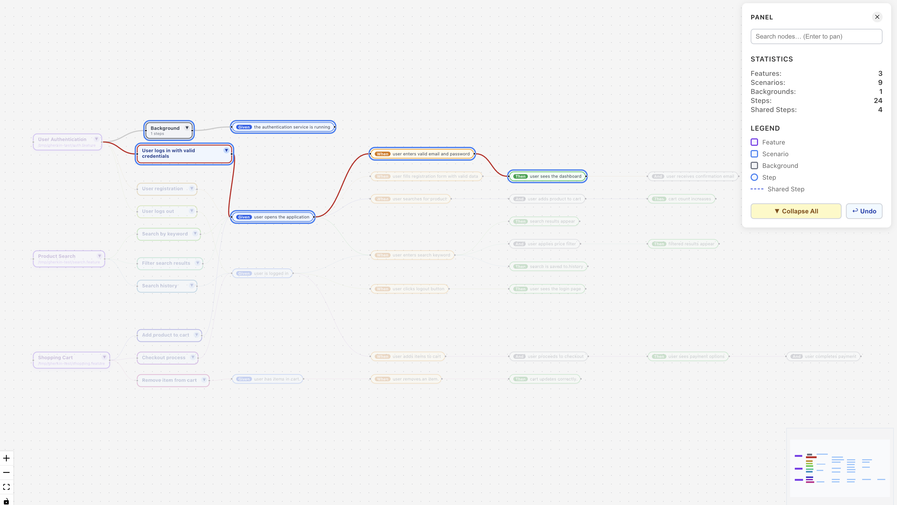
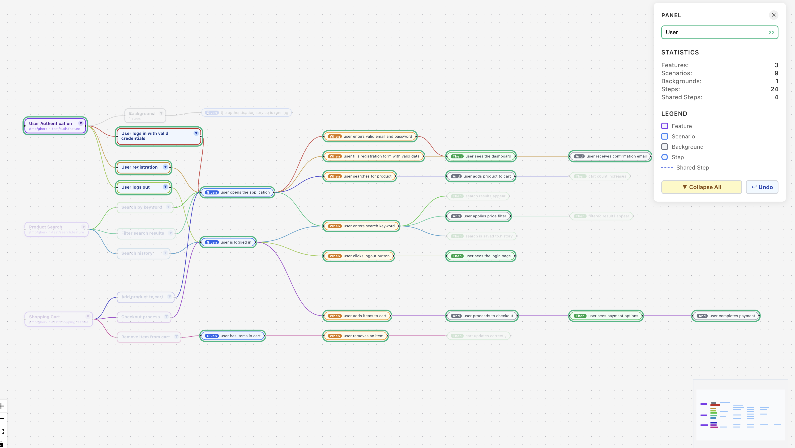
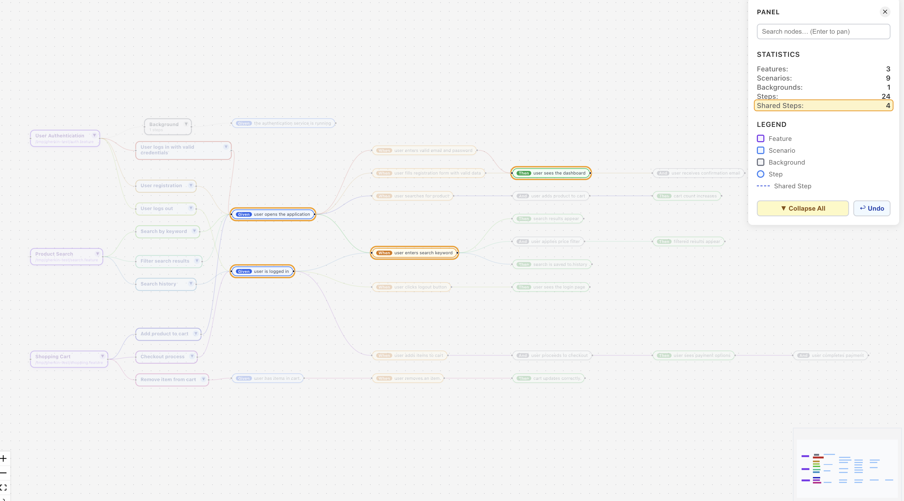

# Visual Gherkin


An interactive visualization tool that renders Gherkin `.feature` files as a navigable graph — giving teams a live map of their BDD test suite.



---

## Key Highlights

- **Auto-discovers** all `.feature` files in a directory (recursive)
- **Live reload** — file watcher detects changes and updates the graph instantly
- **Shared step detection** — identical steps across scenarios are merged into a single node, revealing reuse patterns
- **Per-scenario color coding** — each scenario's edge path gets a unique color for visual tracing
- **Collapse / Expand** — navigate large graphs by folding feature or scenario branches

  

- **Subtree highlight** — double-click any node to isolate its full execution path

  

- **Search** — filter nodes by name or keyword; viewport pans to the first match

  
- **Undo** — Ctrl+Z reverses collapse, expand, and drag moves
- **Minimap** — spatial overview for large graphs (300–500+ nodes)
- **Self-contained binary** — no Node.js required on target machine

---

## Use Cases

| Scenario | What it helps with |
|---|---|
| New team member onboarding | See the full test landscape at a glance without reading dozens of files |
| Sprint planning | Identify which features and scenarios are covered vs gaps |
| Regression triage | Trace which scenarios share a failing step |
| Feature file review | Spot duplicated steps, inconsistent naming, or missing coverage |
| Cross-team communication | Share a visual map of test flows in demos or documentation |
| Refactoring | Find shared steps before renaming or restructuring |

---

## What Information Can Be Gathered

- **Coverage map** — which features have background steps, how many scenarios each feature has
- **Shared steps** — steps reused across multiple scenarios (highlighted separately in stats)

  
- **Scenario chains** — the exact sequence of Given/When/Then steps for any scenario
- **Step reuse rate** — how many steps are shared vs unique (visible in statistics panel)
- **Tag distribution** — tags shown on each scenario node for quick filtering context
- **File structure** — which feature file each node originates from

---

## Who Benefits

### QA Engineers
- Visualize the full regression suite without opening files
- Quickly identify scenarios that share steps — a change to one affects all
- Use search to find all scenarios covering a specific behaviour
- Spot missing edge cases by seeing the graph shape of a feature

### Business Analysts
- Communicate acceptance criteria visually in reviews and handoffs
- Verify that all agreed scenarios are present without reading Gherkin syntax
- Use the color-coded scenario paths to walk stakeholders through flows
- Identify overlapping or contradictory scenarios across features

### Developers
- Understand test intent before implementing a feature
- Find shared steps to reuse when writing new scenarios
- Use subtree highlight to understand the full impact of changing a step
- Detect test debt — features with no scenarios, scenarios with no steps

---

## How to Launch

### Using the pre-built binary (no Node.js required)

**macOS**
```bash
./visual-gherkin-macos
# or on a custom port
./visual-gherkin-macos --port 8080
```

**Linux**
```bash
./visual-gherkin-linux
./visual-gherkin-linux --port 8080
```

**Windows**
```cmd
visual-gherkin-win.exe
visual-gherkin-win.exe --port 8080
```

Default port: **17771** — open `http://localhost:17771` in your browser.

Port resolution order: `--port` flag → `PORT` environment variable → `17771`

### Using the start scripts (requires Node.js + built dist/)

**macOS / Linux**
```bash
./start.sh
```

**Windows**
```cmd
start.bat
```

Both scripts auto-create `.env` from `.env.example` on first run, kill any existing process on the configured ports, build, and start.

### Loading your feature files

1. Open the browser at the server URL
2. Enter the path to your feature file directory (e.g. `/path/to/project/tests/e2e`)
3. The graph renders automatically — nested directories are scanned recursively
4. The graph auto-updates when `.feature` files change on disk
